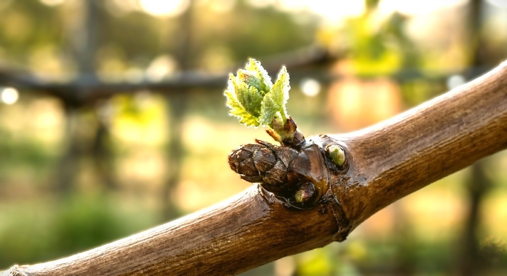

# MADRONA RIDGE ESTATE
## The Sovereign Pentad Archive: Genetic Continuity Trials

**Location:** Mudge Island, BC | 200ft Vertical Terraces | Volcanic Gneiss
**Research Lead:** [Ricardo A. Mair/Principal Conservator]
**Contact:**[research@madronaridge.vin](mailto:research@madronaridge.vin)

---

### 🏛️ The Edenbank Gladiator (Accession #001)
Our flagship **Sovereign Coronation** was recovered from the boundary of the historic **A.C. Wells Edenbank Farm (est. 1866)** in Sardis, BC. Found integrated into a decades-old perimeter fence between a riparian creek and urban encroachment, this "Gladiator" vine demonstrates the extreme resilience of the Sovereign series. It is currently our primary subject for tracking adaptation from alluvial valley silt to high-mineral volcanic rock.

### 📊 Current Accession Ledger (Spring 2026)

| ID | Variety | Phase | Source / Provenance | Status (March 31) |
| :--- | :--- | :--- | :--- | :--- |
| **SR-01** | **Sovereign Coronation** | **Secured** | **Edenbank Farm (1866)** | **Woody Bud Phase** |
| **SR-02** | **Sovereign Opal** | **Found** | **Sandhill / Okanagan** | **Inbound Trial** |
| **SR-03** | **Sovereign Rose** | **Search** | **Similkameen Heritage** | **Active Bounty** |
| **SR-04** | **Sovereign Noir** | **Search** | **Summerland (SuRDC)** | **Phase III Target** |
| **SR-05** | **Sovereign Tiara** | **Search** | **BC Vineyard Network** | **Future Accession** |

### 🔬 Research Objectives
* **Phenological Tracking:** Monitoring the adaptation of Summerland hybrids to maritime-volcanic buffers.
* **Terroir Interaction:** Documenting the "Acid-Sugar Delta" on high-UV Gneiss terraces.
* **Genetic Sanctuary:** Providing a secure site for heritage BC viticulture wood.

**Contact:** [View Technical Logs & Accession History →](README.md)
---
*“Rescuing the past to architect the future of the Ridge.”*
